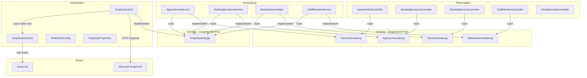
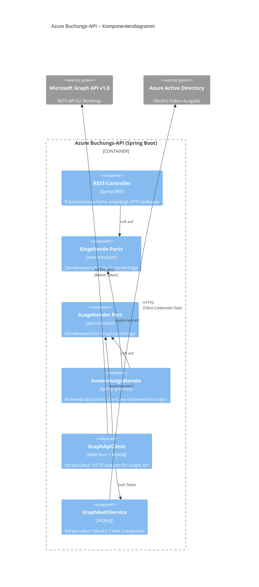
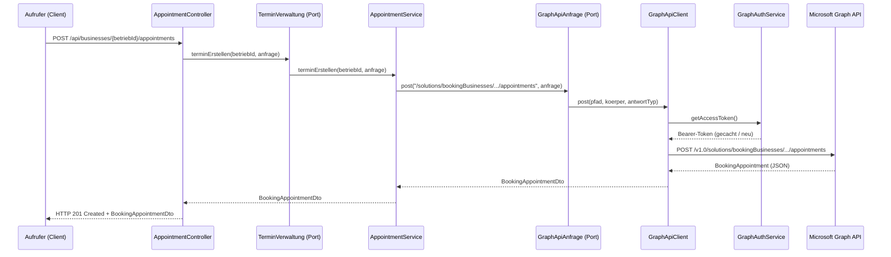
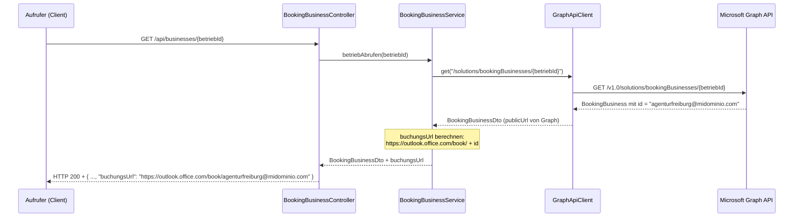

# Architektur-Dokumentation – Azure Buchungs-API

## Überblick

Die **Azure Buchungs-API** ist ein Spring-Boot-REST-Dienst, der als Proxy zwischen internen
Systemen und der **Microsoft Bookings API (Microsoft Graph v1.0)** fungiert.

Sie ermöglicht die programmgesteuerte Verwaltung von Buchungsagenturen, Mitarbeitern,
Diensten und Terminen innerhalb eines einzigen Azure-AD-Mandanten (Tenant).

Jede Agentur besitzt eine eindeutige, dynamische Buchungs-URL:

```
https://outlook.office.com/book/{agenturName}@midominio.com
```

> **Wichtig:** Der Agenturname ist immer dynamisch und wird aus der Agentur-ID
> (der `id`-Eigenschaft des `BookingBusiness`) abgeleitet. Er wird niemals hartcodiert.

---

## Architekturprinzip: Onion Architecture

Das Projekt folgt strikt der **Onion-Architektur** (auch bekannt als *Ports & Adapters*
oder *Hexagonale Architektur*).

### Grundprinzip

```
┌─────────────────────────────────────────────────────────┐
│                  PRÄSENTATION (äußerste Schicht)        │
│   REST-Controller → rufen Domänenports (Interfaces) auf │
│  ┌───────────────────────────────────────────────────┐  │
│  │              INFRASTRUKTUR                        │  │
│  │   Graph-API-Client → implementiert Domänenport    │  │
│  │  ┌─────────────────────────────────────────────┐  │  │
│  │  │           ANWENDUNG                         │  │  │
│  │  │  Anwendungsdienste → implementieren         │  │  │
│  │  │  eingehende Domänenports                    │  │  │
│  │  │  ┌───────────────────────────────────────┐  │  │  │
│  │  │  │          DOMÄNE (innerste Schicht)     │  │  │  │
│  │  │  │  Eingehende Ports (Use-Case-Interfaces)│  │  │  │
│  │  │  │  Ausgehende Ports (Adapter-Interfaces) │  │  │  │
│  │  │  └───────────────────────────────────────┘  │  │  │
│  │  └─────────────────────────────────────────────┘  │  │
│  └───────────────────────────────────────────────────┘  │
└─────────────────────────────────────────────────────────┘
```

### Abhängigkeitsregel (Dependency Rule)

Alle Abhängigkeiten zeigen **nach innen** – niemals nach außen:

- **Präsentation** → hängt ab von *Domäne* (Ports)
- **Anwendung** → hängt ab von *Domäne* (Ports)
- **Infrastruktur** → hängt ab von *Domäne* (Ports) und *Anwendung*
- **Domäne** → hat **keine** Abhängigkeiten von äußeren Schichten

---

## Paketstruktur

```
com.booking.azure/
│
├── domain/                        ← DOMÄNENSCHICHT (innerste Schicht)
│   └── port/
│       ├── in/                    ← Eingehende Ports (Use-Case-Interfaces)
│       │   ├── TerminVerwaltung
│       │   ├── AgenturVerwaltung
│       │   ├── DienstVerwaltung
│       │   └── MitarbeiterVerwaltung
│       └── out/                   ← Ausgehende Ports (Adapter-Interfaces)
│           └── GraphApiAnfrage
│
├── service/                       ← ANWENDUNGSSCHICHT
│   ├── AppointmentService         → implements TerminVerwaltung
│   ├── BookingBusinessService     → implements AgenturVerwaltung
│   ├── BookingServiceMgr          → implements DienstVerwaltung
│   ├── StaffMemberService         → implements MitarbeiterVerwaltung
│   ├── GraphApiClient             → implements GraphApiAnfrage (Infrastruktur)
│   └── GraphAuthService           (Azure-AD-OAuth2-Token-Verwaltung)
│
├── controller/                    ← PRÄSENTATIONSSCHICHT
│   ├── AppointmentController      → inject TerminVerwaltung
│   ├── BookingBusinessController  → inject AgenturVerwaltung
│   ├── BookingServiceController   → inject DienstVerwaltung
│   └── StaffMemberController      → inject MitarbeiterVerwaltung
│
├── config/                        ← INFRASTRUKTURSCHICHT (Konfiguration)
│   ├── CorsConfig
│   ├── GraphApiProperties
│   └── WebClientConfig
│
├── dto/                           ← PRÄSENTATIONSSCHICHT (Datentransfer)
│   ├── request/
│   └── ...
│
└── exception/                     ← PRÄSENTATIONSSCHICHT
    └── GlobalExceptionHandler
```

---

## Schichtendiagramm (Mermaid)



---

## Komponentendiagramm (Mermaid)



---

## Ablaufdiagramm: Termin erstellen



---

## Ablaufdiagramm: Dynamische Buchungs-URL



---

## Domains und Ports

### Eingehende Ports (Primary Ports / Use Cases)

| Interface | Zuständigkeit | Implementierung |
|-----------|---------------|-----------------|
| `TerminVerwaltung` | Termine erstellen, abrufen, stornieren | `AppointmentService` |
| `AgenturVerwaltung` | Buchungsbetriebe verwalten, URL berechnen | `BookingBusinessService` |
| `DienstVerwaltung` | Dienstleistungen verwalten | `BookingServiceMgr` |
| `MitarbeiterVerwaltung` | Mitarbeiter verwalten, Verfügbarkeit abfragen | `StaffMemberService` |

### Ausgehende Ports (Secondary Ports / Adapters)

| Interface | Zuständigkeit | Implementierung |
|-----------|---------------|-----------------|
| `GraphApiAnfrage` | HTTP-Anfragen an Microsoft Graph | `GraphApiClient` |

---

## Buchungs-URL: Dynamisches Muster

Die öffentliche Buchungsseite einer Agentur folgt folgendem Muster:

```
https://outlook.office.com/book/{agenturName}@midominio.com
```

| Element | Erklärung |
|---------|-----------|
| `https://outlook.office.com/book/` | Feste Basis-URL (konfigurierbar in `application.yml`) |
| `{agenturName}` | Dynamisch – ergibt sich aus der Betriebs-ID in Microsoft Bookings |
| `@midominio.com` | Domain des Azure-AD-Mandanten |

**Beispiele:**

| Agentur | ID in Graph | Buchungs-URL |
|---------|-------------|--------------|
| Agentur Berlin | `agenturberlinge@midominio.com` | `https://outlook.office.com/book/agenturberlinge@midominio.com` |
| Agentur München | `agenturmuenchen@midominio.com` | `https://outlook.office.com/book/agenturmuenchen@midominio.com` |
| Agentur Hamburg | `agenturhamburg@midominio.com` | `https://outlook.office.com/book/agenturhamburg@midominio.com` |

> Die URL wird serverseitig in `BookingBusinessService.buchungsUrlSetzen()` berechnet
> und im Feld `buchungsUrl` des `BookingBusinessDto` zurückgegeben.

---

## Authentifizierung

```mermaid
graph LR
    A[Azure Buchungs-API] -->|Client Credentials Flow| B[Azure AD]
    B -->|Bearer Token| A
    A -->|Authorization: Bearer {token}| C[Microsoft Graph API]
    C -->|Bookings-Daten| A
```

**Ablauf:**
1. Die Anwendung sendet `clientId` + `clientSecret` an Azure AD
2. Azure AD gibt einen zeitlich begrenzten Bearer-Token zurück
3. Der Token wird gecacht und automatisch erneuert (5 Minuten vor Ablauf)
4. Jede Graph-API-Anfrage enthält den Token im `Authorization`-Header

**Benötigte Azure-AD-Berechtigungen:**

| Berechtigung | Typ | Zweck |
|-------------|-----|-------|
| `Bookings.ReadWrite.All` | Application | Buchungsbetriebe, Mitarbeiter, Dienste verwalten |
| `BookingsAppointment.ReadWrite.All` | Application | Termine erstellen und lesen |

---

## Technologiestack

| Komponente | Technologie |
|-----------|-------------|
| Laufzeitumgebung | Java 17 |
| Framework | Spring Boot 3.2.x |
| HTTP-Client | Spring WebFlux (WebClient) + Reactor Netty |
| Authentifizierung | MSAL4J (Microsoft Authentication Library) |
| JSON | Jackson Databind |
| Code-Boilerplate | Lombok |
| Build | Maven 3.x |
| API-Dokumentation | OpenAPI 3.0 (openapi.yml) |

---

## Konfiguration

Alle sensiblen Werte werden über Umgebungsvariablen gesetzt:

```bash
# Windows PowerShell
$env:AZURE_TENANT_ID     = "xxxxxxxx-xxxx-xxxx-xxxx-xxxxxxxxxxxx"
$env:AZURE_CLIENT_ID     = "xxxxxxxx-xxxx-xxxx-xxxx-xxxxxxxxxxxx"
$env:AZURE_CLIENT_SECRET = "IhrClientSecret"
```

Oder direkt in `application.yml` (nur für lokale Entwicklung):

```yaml
azure:
  graph:
    tenant-id:     IhreMandantenId
    client-id:     IhreClientId
    client-secret: IhrClientSecret

buchung:
  buchungs-basis-url: https://outlook.office.com/book/
```
