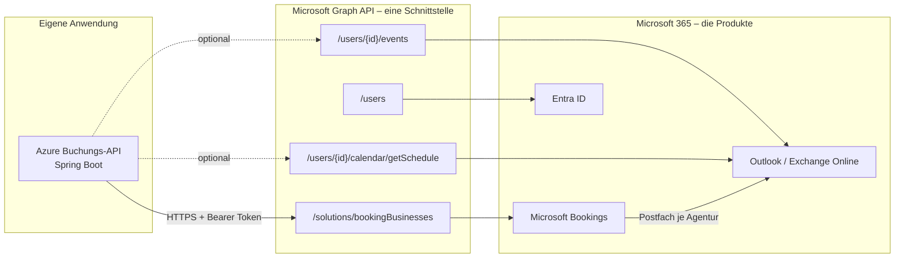
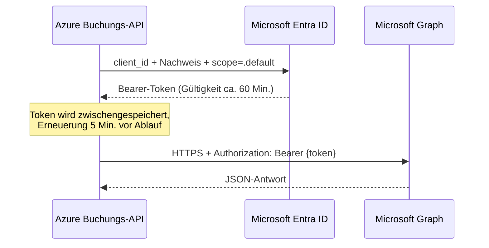
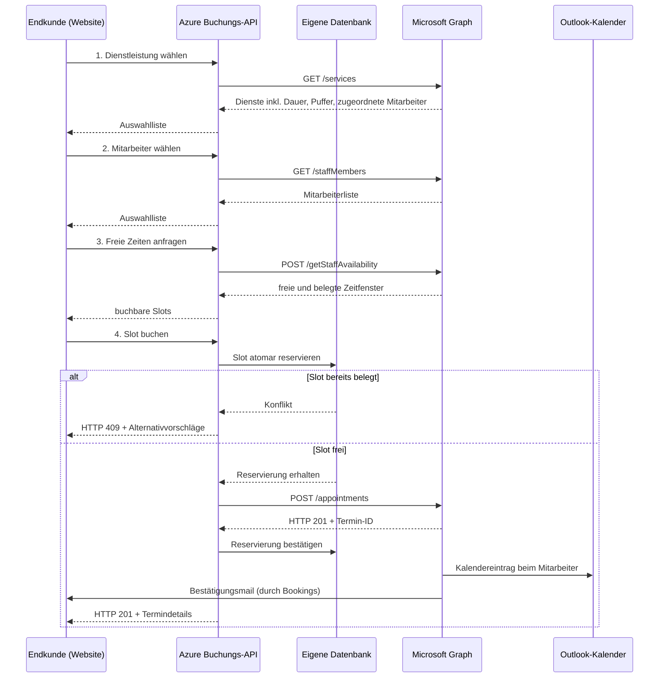
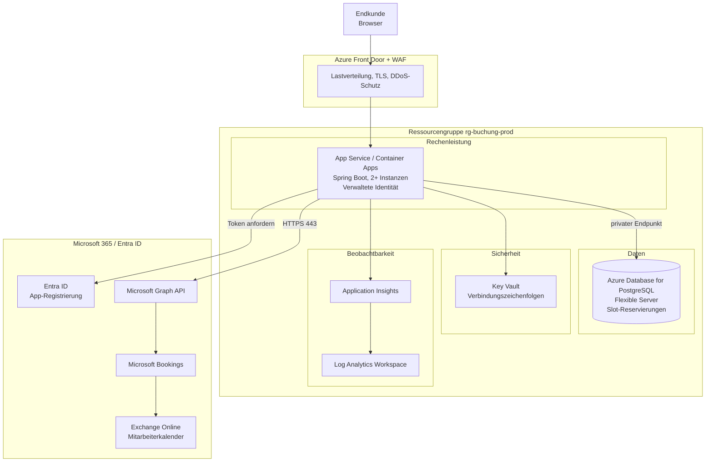

# Technisches Konzept: Terminbuchung über Microsoft Graph

**Dokumententyp:** Kundeninformation / Entscheidungsgrundlage
**Projekt:** Azure Buchungs-API (`azure_booking`)
**Stand:** 29.07.2026
**Analysierter Zweig:** `feature/init-webclient`

---

## Inhaltsverzeichnis

1. [Management Summary](#1-management-summary)
2. [Microsoft Bookings vs. Microsoft Graph API – der exakte Unterschied](#2-microsoft-bookings-vs-microsoft-graph-api--der-exakte-unterschied)
3. [Entscheidungsmatrix: Wann welcher Ansatz?](#3-entscheidungsmatrix-wann-welcher-ansatz)
4. [Was ist für die Graph-Integration notwendig?](#4-was-ist-für-die-graph-integration-notwendig)
5. [Mitarbeiterauswahl und Kalendereintrag](#5-mitarbeiterauswahl-und-kalendereintrag)
6. [Doppelbuchungen und Nebenläufigkeit](#6-doppelbuchungen-und-nebenläufigkeit)
7. [Notwendige Azure-Infrastruktur](#7-notwendige-azure-infrastruktur)
8. [Lizenzen und Voraussetzungen in Microsoft 365](#8-lizenzen-und-voraussetzungen-in-microsoft-365)
9. [Grenzen, Risiken und Betriebshinweise](#9-grenzen-risiken-und-betriebshinweise)
10. [Umsetzungsfahrplan und Aufwandsschätzung](#10-umsetzungsfahrplan-und-aufwandsschätzung)
11. [Offene Fragen an den Kunden](#11-offene-fragen-an-den-kunden)
12. [Glossar](#12-glossar)

---

## 1. Management Summary

Die bestehende Anwendung ist ein Spring-Boot-Dienst, der als Vermittler zwischen
eigenen Systemen und **Microsoft Bookings** über die **Microsoft Graph API** arbeitet.
Sie kann bereits Buchungsagenturen, Dienstleistungen, Mitarbeiter und Termine
programmgesteuert verwalten.

**Die drei zentralen Aussagen dieses Berichts:**

1. **Microsoft Bookings und die Graph API sind keine Alternativen zueinander.**
   Bookings ist das Produkt (Datenhaltung, Geschäftslogik, Selbstbuchungsseite),
   Graph ist die einzige programmatische Schnittstelle zu diesem Produkt.
   Die echte Entscheidung lautet: *Standard-Buchungsseite von Microsoft* vs.
   *eigenes Frontend auf Bookings über Graph* vs. *reiner Outlook-Kalender über Graph*.
   Siehe [Kapitel 2](#2-microsoft-bookings-vs-microsoft-graph-api--der-exakte-unterschied).

2. **Der administrative Termin-Endpunkt von Graph prüft keine Verfügbarkeit.**
   Microsoft erlaubt hier bewusst Überbuchung, damit Personal Termine außerhalb der
   Öffnungszeiten erzwingen kann. Wer ein eigenes Frontend baut, **muss die
   Kollisionsprüfung selbst implementieren.** Das ist kein Randfall, sondern
   Kernanforderung. Siehe [Kapitel 6](#6-doppelbuchungen-und-nebenläufigkeit).

3. **Die Anwendung benötigt eigenen Zustand (Datenbank).**
   Graph bietet keine atomaren Primitive (kein Sperren, kein ETag auf Terminen).
   Ohne eine eigene Datenbank als Schiedsrichter lässt sich Doppelbuchung technisch
   nicht ausschließen. Das ist der wichtigste infrastrukturelle Zusatzbedarf.

**Geschätzter Aufwand bis Produktionsreife der Buchungslogik:** ca. 6 Personentage
Entwicklung zzgl. Infrastruktur-Setup (siehe [Kapitel 10](#10-umsetzungsfahrplan-und-aufwandsschätzung)).

---

## 2. Microsoft Bookings vs. Microsoft Graph API – der exakte Unterschied

### 2.1 Die häufigste Verwechslung

Die beiden Begriffe stehen **nicht auf derselben Ebene**:

| | Microsoft Bookings | Microsoft Graph API |
|---|---|---|
| **Was es ist** | Eine **Anwendung** in Microsoft 365 | Eine **REST-Schnittstelle** zu Microsoft 365 |
| **Kategorie** | Produkt / SaaS-Dienst | Programmierschnittstelle (API) |
| **Datenhaltung** | Ja – eigene Postfächer in Exchange Online | Nein – speichert nichts, greift nur zu |
| **Benutzeroberfläche** | Ja – Verwaltungsportal + öffentliche Buchungsseite | Nein – reines JSON über HTTPS |
| **Geschäftslogik** | Ja – Öffnungszeiten, Puffer, Vorlaufzeiten, E-Mails | Nein – reicht Anfragen an das Produkt weiter |
| **Kostet extra** | In M365-Lizenzen enthalten | Kostenlos, Teil der Plattform |

**Korrekte Formulierung:** Microsoft Bookings *wird über* die Microsoft Graph API
angesprochen. Der Bookings-Bereich innerhalb von Graph liegt unter dem Pfad
`/v1.0/solutions/bookingBusinesses`.

Graph ist gleichzeitig die Schnittstelle zu vielen weiteren Microsoft-365-Diensten:
Outlook-Kalender, E-Mail, Teams, SharePoint, Entra ID (früher Azure AD), OneDrive.
Bookings ist nur eine von vielen Arbeitslasten dahinter.



### 2.2 Die drei realistischen Umsetzungsvarianten

Die eigentliche Architekturentscheidung liegt zwischen diesen drei Wegen:

#### Variante A — Standard-Buchungsseite von Microsoft

Der Kunde bucht direkt auf `https://outlook.office.com/book/{agentur}@ihre-domain.de`.

- Keine Entwicklung notwendig, Konfiguration im Bookings-Portal genügt.
- Microsoft prüft Verfügbarkeit, Öffnungszeiten, Puffer und Vorlaufzeiten **selbst**.
- **Doppelbuchungen sind ausgeschlossen** – das ist der entscheidende Vorteil.
- Bestätigungs- und Erinnerungsmails verschickt Microsoft automatisch.
- Nachteil: Optik, Formularfelder und Ablauf sind kaum anpassbar. Keine Integration
  in eigene Prozesse (CRM, Zahlung, Kundenkonto).

#### Variante B — Eigenes Frontend auf Bookings über Graph *(aktueller Projektstand)*

Die eigene Anwendung schreibt über `POST /solutions/bookingBusinesses/{id}/appointments`.

- Volle Kontrolle über Oberfläche, Sprache, Felder und Prozess.
- Bookings bleibt die führende Datenhaltung: Mitarbeiter, Dienste, Öffnungszeiten
  und Kalendersynchronisation bleiben erhalten.
- Das Bookings-Verwaltungsportal steht dem Personal weiterhin zur Verfügung.
- **Nachteil und Kernrisiko:** Der verwendete Endpunkt ist der *administrative*
  Endpunkt. Er **prüft keine Verfügbarkeit** und lässt Überbuchung bewusst zu.
  Die Kollisionsprüfung ist Aufgabe der eigenen Anwendung.

> **Hinweis zur Präzision:** Graph bietet unter `/solutions/bookingBusinesses/{id}/appointments`
> zusätzlich einen kundenseitigen Pfad (`createAppointment` im Selbstbedienungskontext
> mit delegierten Rechten), der Verfügbarkeitsregeln anwendet. Dieser ist jedoch an
> einen angemeldeten Endbenutzer gebunden und für eine Server-zu-Server-Integration
> mit Anwendungsrechten **nicht nutzbar**. Für den hier gewählten Weg gilt daher
> uneingeschränkt: eigene Prüfung erforderlich.

#### Variante C — Reiner Outlook-Kalender über Graph, ohne Bookings

Termine werden direkt als Kalenderereignisse geschrieben:
`POST /users/{upn}/calendar/events`, Verfügbarkeit über `/calendar/getSchedule`
oder `/findMeetingTimes`.

- Maximale Freiheit: beliebiges Datenmodell, beliebige Ressourcen.
- Keine Bookings-Lizenzabhängigkeit, kein Bookings-Postfach.
- **Alles muss selbst gebaut werden:** Dienstleistungskatalog, Öffnungszeiten,
  Puffer, Stornierungslogik, Kundenbenachrichtigungen, Stornierungs-Links,
  Verwaltungsoberfläche für das Personal.
- Deutlich höherer Entwicklungs- und Wartungsaufwand.

### 2.3 Direktvergleich

| Kriterium | A: Bookings-Seite | B: Graph + Bookings | C: Graph + Outlook |
|---|---|---|---|
| Entwicklungsaufwand | keiner | mittel | hoch |
| Gestaltungsfreiheit Frontend | sehr gering | vollständig | vollständig |
| Verfügbarkeitsprüfung | durch Microsoft | **selbst zu bauen** | **selbst zu bauen** |
| Doppelbuchungsschutz | durch Microsoft | **selbst zu bauen** | **selbst zu bauen** |
| Dienstleistungskatalog | Bookings | Bookings | selbst zu bauen |
| Öffnungszeiten / Puffer | Bookings | Bookings | selbst zu bauen |
| Kunden-E-Mails | automatisch | automatisch (abschaltbar) | selbst zu bauen |
| Mitarbeiterkalender | automatisch | automatisch | manuell |
| Verwaltungsportal für Personal | ja | ja | selbst zu bauen |
| CRM-/Zahlungsintegration | nein | ja | ja |
| Mehrmandantenfähigkeit | eingeschränkt | eingeschränkt | frei |
| Betriebsaufwand | minimal | mittel | hoch |

### 2.4 Empfehlung

**Variante B ist für das vorliegende Projekt die richtige Wahl** und entspricht dem
bereits umgesetzten Stand. Sie liefert die geforderte Gestaltungsfreiheit, ohne dass
Dienstleistungskatalog, Arbeitszeiten und Kalendersynchronisation neu gebaut werden
müssen.

**Bedingung:** Die in [Kapitel 6](#6-doppelbuchungen-und-nebenläufigkeit) beschriebene
Kollisionsprüfung muss vor Produktivbetrieb umgesetzt sein. Ohne sie ist Variante B
gegenüber Variante A ein funktionaler Rückschritt.

Variante C ist nur dann zu empfehlen, wenn Ressourcen gebucht werden, die Bookings
nicht abbildet (Räume, Geräte, Fahrzeuge), oder wenn Kunden aus verschiedenen
Mandanten bedient werden sollen.

---

## 3. Entscheidungsmatrix: Wann welcher Ansatz?

| Anforderung des Kunden | Empfohlene Variante |
|---|---|
| Schnellstmöglich online, Optik zweitrangig | **A** – Bookings-Seite |
| Buchung im eigenen Corporate Design / eigener Website | **B** |
| Buchung als Schritt in einem größeren Prozess (Zahlung, Vertrag, Kundenkonto) | **B** |
| Termine sollen im Outlook-Kalender der Mitarbeiter erscheinen | **A** oder **B** |
| Personal soll Termine weiterhin in einem Microsoft-Portal pflegen | **A** oder **B** |
| Buchung von Räumen, Geräten, Fahrzeugen statt Personen | **C** |
| Buchungslogik weicht stark vom Bookings-Modell ab (Serien, Kontingente, Warteliste) | **C** |
| Endkunden ohne Microsoft-365-Konto sollen buchen | alle drei möglich |
| Mehrere Kundenmandanten aus einer Anwendung bedienen | **C** oder Multi-Tenant-App |

---

## 4. Was ist für die Graph-Integration notwendig?

### 4.1 Registrierung in Microsoft Entra ID

Voraussetzung ist eine **App-Registrierung** im Entra-ID-Mandanten des Kunden.
Diese liefert die drei Werte, die die Anwendung bereits erwartet
(`application.yml`, Präfix `azure.graph`):

| Wert | Konfigurationsschlüssel | Umgebungsvariable |
|---|---|---|
| Mandanten-ID (Tenant) | `azure.graph.tenant-id` | `AZURE_TENANT_ID` |
| Anwendungs-ID (Client) | `azure.graph.client-id` | `AZURE_CLIENT_ID` |
| Geheimnis oder Zertifikat | `azure.graph.client-secret` | `AZURE_CLIENT_SECRET` |

### 4.2 Authentifizierungsverfahren

Die Anwendung verwendet den **OAuth-2.0-Client-Credentials-Flow** (Server-zu-Server,
ohne angemeldeten Benutzer) über die Bibliothek **MSAL4J**.



**Drei Nachweisverfahren, nach Sicherheit geordnet:**

| Verfahren | Sicherheit | Empfehlung |
|---|---|---|
| Client-Secret | niedrig – Ablauf max. 24 Monate, manuelle Rotation | nur für Entwicklung |
| Zertifikat | mittel – längere Laufzeit, kein Klartextgeheimnis | akzeptabel |
| **Verwaltete Identität** (Managed Identity) | **hoch – gar kein Geheimnis vorhanden** | **produktiv empfohlen** |

Bei einer verwalteten Identität erhält die Azure-Ressource (App Service oder
Container App) selbst eine Identität in Entra ID. Es existiert kein Geheimnis, das
gestohlen, versehentlich eingecheckt oder vergessen rotiert werden kann. Die
Graph-Berechtigungen werden dem Dienstprinzipal der verwalteten Identität zugewiesen.

> **Umstellungsaufwand:** gering. `GraphAuthService` und `WebClientConfig` müssten
> auf `DefaultAzureCredential` (Azure Identity SDK) statt MSAL-Client-Secret
> umgestellt werden. Empfehlung: gleich beim Übergang in die Cloud-Umgebung erledigen.

### 4.3 Erforderliche Graph-Berechtigungen

Alle Berechtigungen sind vom Typ **Anwendung** (nicht *delegiert*) und benötigen
zwingend die **Administratorzustimmung** eines globalen Administrators des
Kundenmandanten.

| Berechtigung | Zweck | Notwendig für |
|---|---|---|
| `BookingsAppointment.ReadWrite.All` | Termine lesen, erstellen, ändern, stornieren | Kernfunktion |
| `Bookings.ReadWrite.All` | Agenturen, Dienste, Mitarbeiter verwalten | Stammdatenpflege |
| `Bookings.Read.All` | Nur-Lese-Zugriff | Reine Anzeigefälle |
| `Bookings.Manage.All` | Vollzugriff inkl. Veröffentlichen der Buchungsseite | `publish` / `unpublish` |
| `Calendars.ReadWrite` | Direktes Schreiben in Mitarbeiterkalender | nur Variante C |
| `User.Read.All` | Mitarbeiterstammdaten aus Entra ID lesen | optionaler Abgleich |

**Wichtiger Grundsatz:** So wenig wie möglich. `Bookings.Manage.All` schließt die
anderen Bookings-Rechte ein – wo es vergeben wird, sind die übrigen überflüssig.
`Calendars.ReadWrite` als Anwendungsrecht bedeutet ohne weitere Maßnahme **Lese- und
Schreibzugriff auf sämtliche Postfächer des Mandanten**. Dazu unbedingt
[Abschnitt 4.4](#44-einschränkung-des-postfachzugriffs) beachten.

### 4.4 Einschränkung des Postfachzugriffs

Sollte `Calendars.ReadWrite` benötigt werden, muss der Zugriff auf die tatsächlich
betroffenen Postfächer begrenzt werden. Exchange Online bietet dafür zwei Verfahren:

1. **RBAC für Anwendungen** (aktuelles, empfohlenes Verfahren) – Rollenzuweisung
   für den Dienstprinzipal, begrenzt auf einen Verwaltungsbereich (Scope).
2. **Application Access Policy** (älteres Verfahren) – Begrenzung auf eine
   Sicherheitsgruppe per Exchange-Online-PowerShell:

```powershell
New-ApplicationAccessPolicy `
    -AppId "<client-id>" `
    -PolicyScopeGroupId "buchungs-mitarbeiter@ihre-domain.de" `
    -AccessRight RestrictAccess `
    -Description "Buchungs-API: Zugriff nur auf Buchungsmitarbeiter"
```

Ohne eine dieser Maßnahmen ist die Berechtigung aus Datenschutzsicht (DSGVO,
Art. 32 – Sicherheit der Verarbeitung) nicht vertretbar.

### 4.5 Verwendete Graph-Endpunkte

Die Anwendung spricht bereits folgende Endpunkte an:

| Zweck | HTTP | Graph-Pfad |
|---|---|---|
| Agenturen auflisten / anlegen | GET / POST | `/solutions/bookingBusinesses` |
| Agentur lesen / ändern / löschen | GET / PATCH / DELETE | `/solutions/bookingBusinesses/{id}` |
| Buchungsseite veröffentlichen | POST | `/solutions/bookingBusinesses/{id}/publish` |
| Dienste verwalten | GET / POST / PATCH / DELETE | `/solutions/bookingBusinesses/{id}/services` |
| Mitarbeiter verwalten | GET / POST / PATCH / DELETE | `/solutions/bookingBusinesses/{id}/staffMembers` |
| **Verfügbarkeit abfragen** | POST | `/solutions/bookingBusinesses/{id}/getStaffAvailability` |
| **Termin anlegen** | POST | `/solutions/bookingBusinesses/{id}/appointments` |
| Termin ändern / stornieren | PATCH / DELETE | `/solutions/bookingBusinesses/{id}/appointments/{terminId}` |
| Kalenderansicht (Zeitraum) | GET | `/solutions/bookingBusinesses/{id}/calendarView?start=…&end=…` |

Die eigene REST-Oberfläche spiegelt diese Struktur unter `/api/businesses/…`.

### 4.6 Netzwerkanforderungen

Ausgehende HTTPS-Verbindungen (Port 443) zu:

- `https://login.microsoftonline.com` – Tokenausgabe
- `https://graph.microsoft.com` – Datenzugriff

Beide Ziele müssen in restriktiven Netzwerken (Firewall, Proxy, NSG) freigegeben sein.
Eingehende Verbindungen von Microsoft sind **nicht** erforderlich – außer wenn
Change Notifications (Webhooks) genutzt werden sollen; dann muss ein öffentlich
erreichbarer HTTPS-Endpunkt bereitstehen.

---

## 5. Mitarbeiterauswahl und Kalendereintrag

### 5.1 Ablauf aus Sicht des Endkunden



Die Schritte 4 (Datenbankreservierung) und der Konfliktpfad sind **noch nicht
implementiert** – siehe [Kapitel 6](#6-doppelbuchungen-und-nebenläufigkeit).

### 5.2 Voraussetzung dafür, dass der Termin im Mitarbeiterkalender erscheint

Das ist der Punkt, an dem Integrationen am häufigsten scheitern. Bookings
unterscheidet zwei Arten von Mitarbeitern:

| | **Interner Mitarbeiter** | **Externer Gast** |
|---|---|---|
| E-Mail-Adresse | Benutzerkonto im selben Entra-ID-Mandanten | beliebige externe Adresse |
| M365-Lizenz | erforderlich | nicht erforderlich |
| Kalendereintrag entsteht | **ja, automatisch** | **nein** |
| Persönlicher Kalender blockiert Slots | ja, konfigurierbar | nein |
| Benachrichtigung | Kalendereinladung + E-Mail | nur E-Mail |

**Damit ein Termin im Kalender eines Mitarbeiters landet, müssen alle folgenden
Bedingungen erfüllt sein:**

1. Der Mitarbeiter ist ein Benutzerkonto im selben Entra-ID-Mandanten.
2. Er besitzt eine Microsoft-365-Lizenz mit Exchange Online.
3. Er ist als `staffMember` in der Buchungsagentur angelegt, mit seiner
   Benutzerprinzipalnamen-Adresse (UPN) als `emailAddress`.
4. Seine Mitarbeiter-ID (`staffMemberIds`) ist im Termin-Aufruf enthalten.
5. Er hat die Einladung zur Buchungsagentur angenommen (einmalig, bei Anlage).

Sind diese Bedingungen erfüllt, übernimmt Microsoft den Kalendereintrag,
die Einladung und die Aktualisierung bei Änderung oder Stornierung. Es ist
**kein zusätzlicher Aufruf** von `/users/{id}/events` notwendig – ein solcher
würde zu doppelten Einträgen führen.

### 5.3 Relevante Eigenschaften eines Mitarbeiters

| Eigenschaft | Bedeutung | Empfehlung |
|---|---|---|
| `availabilityIsAffectedByPersonalCalendar` | Private Outlook-Termine blockieren Buchungsslots | **`true`** – verhindert Terminüberschneidungen mit anderen Verpflichtungen |
| `useBusinessHours` | Öffnungszeiten der Agentur übernehmen | `true`, außer bei individuellen Arbeitszeiten |
| `workingHours` | Individuelle Arbeitszeiten je Wochentag | nur wenn `useBusinessHours = false` |
| `role` | `guest`, `administrator`, `viewer`, `externalGuest`, `scheduler`, `teamMember` | `teamMember` für buchbares Personal |
| `isEmailNotificationEnabled` | E-Mail bei neuer Buchung | nach Kundenwunsch |

`availabilityIsAffectedByPersonalCalendar = true` ist die wichtigste Einstellung:
Sie sorgt dafür, dass `getStaffAvailability` auch Termine berücksichtigt, die
außerhalb von Bookings entstanden sind – etwa interne Besprechungen. Ohne diese
Einstellung meldet Graph Slots als frei, an denen der Mitarbeiter in einer
Besprechung sitzt.

### 5.4 Beispielaufruf: Termin anlegen

```http
POST /api/businesses/{betriebId}/appointments
Content-Type: application/json
Idempotency-Key: 8f14e45f-ea8f-4b0d-9c7f-2d1a3b4c5d6e
```

```json
{
  "serviceId": "5d1f2b3c-...",
  "serviceName": "Erstberatung",
  "staffMemberIds": ["a1b2c3d4-..."],
  "startDateTime": { "dateTime": "2026-08-03T10:00:00", "timeZone": "Europe/Berlin" },
  "endDateTime":   { "dateTime": "2026-08-03T11:00:00", "timeZone": "Europe/Berlin" },
  "customers": [{
    "name": "Max Mustermann",
    "emailAddress": "max.mustermann@example.de",
    "phone": "+49 30 1234567"
  }],
  "isLocationOnline": true,
  "optOutOfCustomerEmail": false,
  "reminders": [
    { "offset": "P1D",   "recipients": "allAttendees", "message": "Ihr Termin ist morgen." },
    { "offset": "PT1H",  "recipients": "allAttendees", "message": "Ihr Termin ist in einer Stunde." }
  ]
}
```

Anmerkungen zu einzelnen Feldern:

- **`Idempotency-Key`** (Kopfzeile) ist noch nicht implementiert, aber vorgesehen.
  Sie verhindert Doppeleinträge durch Doppelklick oder Netzwerk-Wiederholung.
- **`isLocationOnline: true`** erzeugt automatisch eine Microsoft-Teams-Besprechung;
  die Beitritts-URL kommt im Feld `joinWebUrl` zurück.
- **`optOutOfCustomerEmail: true`** unterdrückt die Bookings-Standardmails – sinnvoll,
  wenn eigene Benachrichtigungen im Corporate Design versendet werden.
- **`reminders`** verwendet ISO-8601-Dauern (`P1D` = ein Tag, `PT1H` = eine Stunde).

---

## 6. Doppelbuchungen und Nebenläufigkeit

> Dieses Kapitel fasst die ausführliche technische Analyse aus
> `docs/PLAN-COLISION-RESERVAS.md` zusammen.

### 6.1 Ausgangslage

**Der aktuelle Stand lässt Doppelbuchungen zu.** Zwei gleichzeitige Anfragen für
denselben Mitarbeiter zur selben Uhrzeit erzeugen **zwei gültige Termine**.
Das ist kein theoretisches Risiko, sondern das garantierte Verhalten des Codes.

Ursachen:

1. Die Terminerstellung ist eine reine Durchreichung an Graph – ohne
   vorherige Prüfung, ohne Sperre, ohne Transaktion.
2. Die vorhandene Verfügbarkeitsprüfung (`getStaffAvailability`) wird beim
   Anlegen eines Termins **nicht aufgerufen**.
3. Der verwendete Graph-Endpunkt ist der administrative Endpunkt – er erlaubt
   Überbuchung bewusst.
4. Die Anwendung hält keinen eigenen Zustand. Bei mehreren Instanzen hinter
   einem Lastverteiler wäre selbst eine Sperre im Arbeitsspeicher wirkungslos.

### 6.2 Fehlerszenarien

| # | Szenario | Ergebnis heute | Häufigkeit in der Praxis |
|---|---|---|---|
| A | Zwei Kunden, derselbe Slot, gleichzeitig | 2 überlappende Termine | mittel |
| B | Ein Kunde klickt doppelt | 2 identische Termine | **hoch** |
| C | Zeitüberschreitung → automatischer Wiederholungsversuch | 2 identische Termine | **hoch** |
| D | Slot mit Kapazität 1, mehrere App-Instanzen | alle akzeptieren | mittel |
| E | Umbuchung auf einen belegten Slot | wird akzeptiert | niedrig |

Szenarien B und C sind im Produktivbetrieb häufiger als A und lassen sich mit
vergleichsweise geringem Aufwand (Idempotenzschlüssel) beseitigen.

### 6.3 Warum eine Verfügbarkeitsabfrage allein nicht genügt

Ein naheliegender Gedanke ist, vor dem Anlegen einfach `getStaffAvailability`
aufzurufen. Das genügt **nicht**:

```
Zeitpunkt   Anfrage A                 Anfrage B
t=0         prüft Slot → frei
t=0,1                                 prüft Slot → frei
t=0,3       legt Termin an → 201
t=0,4                                 legt Termin an → 201
            ⇒ zwei überlappende Termine
```

Zwischen Prüfung und Schreiben liegt eine Lücke von mehreren hundert Millisekunden
(zwei Graph-Aufrufe à 100–400 ms). Dieses Muster ist als *Time-of-Check-to-Time-of-Use*
bekannt. Bei realistischem Webverkehr ist diese Lücke groß genug, um regelmäßig
getroffen zu werden.

**Auch ein HTTP-Zeitlimit hilft nicht.** Ein Timeout ist eine Wartegrenze, kein
gegenseitiger Ausschluss. Er verhindert nicht, dass zwei Anfragen schreiben – im
Gegenteil, er erzeugt zusätzliche Duplikate durch Wiederholungsversuche.

### 6.4 Lösung: eigener Zustand als Schiedsrichter

Microsoft Graph kann die Rolle der maßgeblichen Instanz nicht übernehmen, weil es
keine atomaren Primitive bietet: keine Sperren, keine bedingten Schreibvorgänge
(kein ETag / `If-Match` auf `bookingAppointment`), keine Transaktionen.

Deshalb benötigt das System **eine eigene Datenbank**, deren Eindeutigkeitsbedingung
die Entscheidung trifft.

```
Kunde
  │
  ├─ Ebene 1: Idempotenz          → beseitigt Duplikate durch Wiederholung
  ├─ Ebene 2: atomare Reservierung → die Datenbankbedingung entscheidet
  ├─ Ebene 3: Schreiben in Graph   → nur der Gewinner erreicht diesen Schritt
  └─ Ebene 4: Abgleich (Job)       → Sicherheitsnetz gegen Abweichungen
```

**Empfohlene Technologie: Azure Database for PostgreSQL Flexible Server.**
PostgreSQL bietet mit `EXCLUDE`-Bedingungen über Zeitbereichen genau die Primitive,
die hier gebraucht werden:

```sql
CREATE EXTENSION IF NOT EXISTS btree_gist;

ALTER TABLE slot_reservation
  ADD CONSTRAINT ex_slot_overlap
  EXCLUDE USING gist (
      business_id     WITH =,
      staff_member_id WITH =,
      tstzrange(start_utc, end_utc, '[)') WITH &&
  ) WHERE (state IN ('PENDING', 'CONFIRMED'));
```

Diese eine Bedingung erkennt auch **teilweise Überschneidungen** – etwa 10:00–11:00
gegen 10:30–11:30 – die eine reine Prüfung auf identische Startzeit übersieht.

**Alternative Redis** (verteilte Sperre mit `SET NX PX`): funktioniert nur, wenn
Redis bereits Teil der Plattform ist. Nachteile: die Ablaufzeit wird zum
Entscheidungskriterium für die Korrektheit (unsicher, da das Ablaufen eines
Schlüssels einen laufenden HTTP-Aufruf nicht abbricht), keine Erkennung teilweiser
Überschneidungen, keine Nachvollziehbarkeit. **Empfehlung: PostgreSQL.**

### 6.5 Kritischer Punkt: Zeitzonennormalisierung

Termine werden als lokale Zeit plus Zonenangabe übertragen. Dieselbe Uhrzeit kann
als `2026-08-01T10:00 Europe/Berlin` oder als `2026-08-01T08:00 UTC` eintreffen.
Werden diese Werte als Zeichenketten gespeichert, **erkennt die Datenbankbedingung
die Kollision nicht**.

**Regel: vor jedem Datenbankzugriff zwingend nach UTC umrechnen.**

```java
private Instant zuInstant(DateTimeTimeZoneDto dto) {
    return LocalDateTime.parse(dto.getDateTime())
            .atZone(ZoneId.of(dto.getTimeZone()))
            .toInstant();
}
```

Testfälle müssen mindestens einen Sommerzeitwechsel abdecken (in Deutschland: letzter
Sonntag im März und im Oktober).

### 6.6 Fremdbuchungen und Abgleich

Termine können auch außerhalb dieser Anwendung entstehen:

- über die öffentliche Bookings-Selbstbuchungsseite,
- über das Bookings-Verwaltungsportal durch das Personal,
- über eine andere Integration.

Diese Termine durchlaufen die eigene Datenbank **nicht**. Die Reservierungslogik
allein sieht sie nicht. Als Sicherheitsnetz ist ein regelmäßiger Abgleich
notwendig (Vorschlag: alle 15 Minuten):

1. `GET /calendarView` für die nächsten 72 Stunden je Agentur.
2. Überschneidungen je Mitarbeiter in der Graph-Antwort erkennen.
3. Mit dem eigenen Datenbestand abgleichen.
4. Bei Abweichung: Kennzahl erhöhen, Warnung auslösen, **nicht automatisch
   stornieren**. Den Termin eines echten Kunden aufgrund eines Abgleichsfehlers
   abzusagen ist schlimmer als die Überschneidung selbst.

**Alternative:** Wird die öffentliche Buchungsseite nicht benötigt, kann sie über
`POST /solutions/bookingBusinesses/{id}/unpublish` deaktiviert werden. Damit bleibt
die eigene Anwendung der einzige Buchungsweg für Endkunden – das Personal kann
weiterhin über das Verwaltungsportal eintragen, weshalb der Abgleich trotzdem
sinnvoll bleibt.

### 6.7 Abnahmekriterien

- [ ] 20 gleichzeitige identische Anfragen → 1 Termin, 19 × `409 Conflict`
- [ ] 20 Anfragen mit identischem `Idempotency-Key` → 1 Termin, 19 × identische `200`
- [ ] Teilüberschneidung 10:00–11:00 gegen 10:30–11:30 → zweite Anfrage `409`
- [ ] `10:00 Europe/Berlin` und `08:00 UTC` werden als derselbe Slot erkannt
- [ ] Graph-Fehler nach erfolgter Reservierung → Slot wird wieder freigegeben
- [ ] Instanzabsturz zwischen Reservierung und Graph-Aufruf → Wiederherstellung
      prüft über `/calendarView`, ob der Termin doch entstand
- [ ] Stornierung gibt den Slot wieder frei
- [ ] Umbuchung gibt den alten Slot frei und belegt den neuen atomar
- [ ] Lasttest mit 2 Instanzen hinter Lastverteiler: 0 Überschneidungen bei 1000 Anfragen

---

## 7. Notwendige Azure-Infrastruktur

### 7.1 Zielarchitektur



### 7.2 Erforderliche Ressourcen

| # | Ressource | Zweck | Vorschlag Dimensionierung |
|---|---|---|---|
| 1 | **Entra ID App-Registrierung** | Identität für den Graph-Zugriff | – (kostenlos) |
| 2 | **App Service** oder **Container Apps** | Betrieb der Spring-Boot-Anwendung | Linux, Plan P1v3, mind. 2 Instanzen |
| 3 | **Azure Database for PostgreSQL Flexible Server** | Slot-Reservierungen, Idempotenz | B2s (Test) / D2ds_v5 (Produktion), Zonenredundanz |
| 4 | **Key Vault** | Verbindungszeichenfolgen, ggf. Zertifikate | Standard |
| 5 | **Application Insights + Log Analytics** | Protokolle, Kennzahlen, Alarme | 30–90 Tage Aufbewahrung |
| 6 | **Verwaltete Identität** | Zugriff ohne Geheimnis | benutzerseitig zugewiesen |

### 7.3 Empfohlene Ergänzungen

| # | Ressource | Zweck | Priorität |
|---|---|---|---|
| 7 | **Azure Front Door** oder **Application Gateway (WAF)** | TLS-Terminierung, DDoS, Regelwerk | hoch bei öffentlichem Zugang |
| 8 | **API Management** | Ratenbegrenzung, API-Schlüssel, Kontingente | hoch bei öffentlichem Zugang |
| 9 | **Private Endpoint + VNet-Integration** | Datenbankverkehr nicht über öffentliches Netz | hoch |
| 10 | **Azure Cache for Redis** | Zwischenspeicher für Verfügbarkeiten, Entlastung von Graph | mittel |
| 11 | **Azure Monitor Alerts** | Alarm bei erkannten Kollisionen, Fehlerraten, Latenz | hoch |
| 12 | **Azure Backup / Point-in-Time-Restore** | Wiederherstellung der Datenbank | hoch |
| 13 | **Deployment Slots** | Blau/Grün-Bereitstellung ohne Ausfall | mittel |

### 7.4 Warum eine Datenbank unverzichtbar ist

Dies ist der wichtigste infrastrukturelle Zusatzbedarf und die häufigste Rückfrage.

Die Anwendung ist derzeit zustandslos und benötigt keine Datenbank – **das ist genau
der Grund, warum Doppelbuchungen möglich sind.** Ohne eine gemeinsame, transaktionale
Instanz gibt es nichts, was zwischen zwei gleichzeitigen Anfragen entscheiden könnte.
Bei zwei oder mehr App-Instanzen ist selbst eine Sperre im Arbeitsspeicher wirkungslos,
weil sie nur innerhalb einer Instanz gilt.

Die Datenbank erfüllt gleichzeitig vier Aufgaben:

1. **Schiedsrichter** bei gleichzeitigen Buchungsversuchen (Eindeutigkeitsbedingung)
2. **Idempotenzspeicher** gegen Doppelklick und Wiederholungsversuche
3. **Prüfprotokoll** – wer hat wann welchen Slot belegt
4. **Grundlage für den Abgleich** mit dem Datenbestand in Graph

Der Speicherbedarf ist gering (wenige Kilobyte je Termin); die Dimensionierung
richtet sich nach Verbindungsanzahl und Verfügbarkeitsanforderung, nicht nach
Datenvolumen.

### 7.5 Umgebungen

Empfohlen sind drei getrennte Umgebungen mit **jeweils eigener App-Registrierung**:

| Umgebung | Zweck | Microsoft-365-Mandant |
|---|---|---|
| Entwicklung | Lokale Entwicklung, Integrationstests | Entwicklermandant (kostenloses M365-Entwicklerprogramm) |
| Test / Abnahme | Kundenabnahme, Lasttests | Testmandant oder abgegrenzte Testagenturen |
| Produktion | Wirkbetrieb | Kundenmandant |

Eine gemeinsame App-Registrierung über mehrere Umgebungen hinweg ist zu vermeiden:
Testdaten würden im Produktivmandanten landen, und ein kompromittiertes
Entwicklungsgeheimnis öffnete den Produktivzugang.

### 7.6 Grobe Kostenordnung

Richtwerte für die Region Westeuropa, ohne Microsoft-365-Lizenzen, ohne Gewähr:

| Position | Größenordnung pro Monat |
|---|---|
| App Service P1v3, 2 Instanzen | ca. 130–160 € |
| PostgreSQL Flexible Server D2ds_v5, zonenredundant | ca. 180–250 € |
| Key Vault, Application Insights, Log Analytics | ca. 20–60 € (nutzungsabhängig) |
| Front Door Standard + WAF | ca. 35–90 € |
| API Management Developer / Basic | ca. 45–150 € |
| **Summe Produktionsumgebung** | **ca. 400–700 €** |

Eine schlanke Startvariante (App Service B2, PostgreSQL B2s, ohne Front Door und
API Management) liegt bei etwa 80–120 € monatlich. Verbindliche Zahlen liefert der
Azure-Preisrechner nach Festlegung von Region, Reservierungslaufzeit und
Verfügbarkeitsanforderung.

---

## 8. Lizenzen und Voraussetzungen in Microsoft 365

Diese Punkte werden erfahrungsgemäß spät entdeckt und blockieren dann den Projektstart.

| Voraussetzung | Details |
|---|---|
| **Microsoft-365-Plan mit Bookings** | Business Standard, Business Premium, E1, E3, E5, A3, A5. In Business Basic ist Bookings **nicht** enthalten. |
| **Bookings mandantenweit aktiviert** | Ein Administrator kann Bookings global deaktiviert haben – dann liefert Graph Fehler, obwohl die Berechtigungen korrekt sind. |
| **Lizenz je buchbarem Mitarbeiter** | Jeder Mitarbeiter, dessen Kalender genutzt wird, benötigt eine eigene Lizenz mit Exchange Online. |
| **Exchange-Online-Postfach je Agentur** | Bookings legt je Buchungsagentur ein eigenes Postfach an. Dieses zählt nicht gegen Benutzerlizenzen, muss aber in Aufbewahrungs- und Compliance-Richtlinien berücksichtigt werden. |
| **Administratorzustimmung** | Die Anwendungsberechtigungen erfordern die einmalige Zustimmung eines globalen Administrators. Ohne diesen Schritt schlägt jeder Aufruf mit `403` fehl. |
| **Obergrenze Buchungsagenturen** | Microsoft begrenzt die Anzahl der Bookings-Postfächer je Mandant. Bei geplanten Dutzenden von Agenturen vorab prüfen. |
| **Datenstandort** | Der Speicherort der Bookings-Daten folgt dem Datenstandort des Mandanten. Für Kunden mit Anforderung „Daten in der EU" vorab bestätigen lassen. |

**Empfehlung:** Diese Punkte vor Entwicklungsbeginn schriftlich vom
IT-Verantwortlichen des Kunden bestätigen lassen. Insbesondere die
Administratorzustimmung ist häufig ein mehrwöchiger organisatorischer Vorgang.

---

## 9. Grenzen, Risiken und Betriebshinweise

### 9.1 Drosselung (Throttling)

Microsoft Graph begrenzt die Anfragerate je Anwendung und Mandant. Bei Überschreitung
antwortet Graph mit `429 Too Many Requests` und einem `Retry-After`-Kopfzeilenwert.

Notwendige Maßnahmen:

- **`Retry-After` respektieren** – nicht mit fester Verzögerung wiederholen.
- **Exponentielles Zurückweichen mit Zufallsanteil** bei `429` und `503`.
- **Zwischenspeichern** selten veränderlicher Daten (Dienste, Mitarbeiter,
  Öffnungszeiten). Verfügbarkeiten nur sehr kurz zwischenspeichern (Sekunden).
- Der Abgleichsjob aus [6.6](#66-fremdbuchungen-und-abgleich) verursacht Grundlast –
  Intervall und Zeitfenster an die Anzahl der Agenturen anpassen.

**Aktuell nicht implementiert:** Der bestehende `GraphApiClient` behandelt `429` nicht
gesondert. Das sollte gemeinsam mit der Buchungslogik nachgezogen werden.

### 9.2 Zeitüberschreitung und Belastbarkeit

Das derzeit konfigurierte Antwortzeitlimit von 30 Sekunden ist zu hoch. Zwei Probleme:

1. Bei langsamen Graph-Antworten bricht der Aufrufer ab und wiederholt – der erste
   Aufruf erreicht Graph aber trotzdem und erzeugt einen Termin. Ergebnis: Duplikat.
2. Während der Wartezeit bleibt ein Server-Arbeitsthread blockiert. Bei
   Standardkonfiguration (200 Threads) legen 200 gleichzeitige langsame Anfragen
   den Dienst lahm.

**Empfehlung: Reduzierung auf ca. 10 Sekunden – jedoch erst *nach* Einführung der
Idempotenz.** Ein kürzeres Zeitlimit erhöht die Zahl der Wiederholungsversuche; ohne
Idempotenz vervielfacht das die Duplikate statt sie zu reduzieren. Die Reihenfolge
ist hier verbindlich.

### 9.3 Weitere technische Befunde

| Befund | Auswirkung | Maßnahme |
|---|---|---|
| Tokenzwischenspeicher in `GraphAuthService` ist nicht threadsicher | Unter Last doppelte Tokenerneuerungen, möglicher Zugriff auf abgelaufenen Token | `AtomicReference` mit unveränderlichem Token-Ablauf-Paar |
| Verzögerte Initialisierung der MSAL-Anwendung ohne Synchronisierung | Mehrfachinitialisierung unter Last | Als Spring-Bean initialisieren |
| Kein Wiederholungsmechanismus für `429`/`503` | Vermeidbare Fehler beim Endkunden | Resilienzschicht (z. B. Resilience4j) |
| Keine Ausgangsdatenvalidierung auf Terminanfragen | Ungültige Anfragen erreichen Graph | Bean Validation in den Anfrage-DTOs |
| Keine Authentifizierung der eigenen REST-Schnittstelle erkennbar | Unbefugte könnten Termine anlegen oder stornieren | Absicherung vor Produktivbetrieb zwingend klären |

Der letzte Punkt ist gesondert zu bewerten: Wird die Schnittstelle öffentlich
erreichbar betrieben, ist eine Authentifizierung und Ratenbegrenzung
**Voraussetzung** für den Produktivbetrieb, nicht Verbesserung.

### 9.4 Datenschutz

Termindaten enthalten personenbezogene Daten (Name, E-Mail-Adresse, Telefonnummer,
teils Gesundheits- oder Vertragsbezug im Feld `customerNotes`). Zu klären:

- Löschfristen für die eigene Reservierungstabelle (Vorschlag: 24 Stunden für
  Idempotenzeinträge, gesetzliche Fristen für Reservierungen)
- Auftragsverarbeitungsvertrag mit Microsoft (über die Online-Dienstebedingungen
  abgedeckt)
- Protokollierung: keine personenbezogenen Daten in Protokolldateien schreiben
- Auskunfts- und Löschbegehren müssen **beide** Datenbestände erfassen: die eigene
  Datenbank und Bookings

---

## 10. Umsetzungsfahrplan und Aufwandsschätzung

### 10.1 Phasen

| Phase | Inhalt | Priorität | Aufwand |
|---|---|---|---|
| 0 | Nebenläufigkeitstest, der den Fehler reproduziert | blockierend | 0,5 T |
| 1 | Threadsicherheit `GraphAuthService` | hoch | 0,5 T |
| 2 | Idempotenzschlüssel (Kopfzeile + Tabelle) | hoch | 1,5 T |
| 3 | **Atomare Slot-Reservierung in PostgreSQL** | **kritisch** | 3,0 T |
| 4 | Antwortzeitlimit auf 10 s senken *(erst nach Phase 2)* | hoch | 0,25 T |
| 5 | Verfügbarkeitsvorprüfung inkl. Alternativvorschlägen | mittel | 1,0 T |
| 6 | Abgleichsjob gegen `/calendarView` | mittel | 2,0 T |
| 7 | Kennzahlen und Alarme | mittel | 1,0 T |
| 8 | Wiederholungslogik für `429`/`503` | mittel | 0,5 T |
| — | Sichtbare Reservierung für den Endkunden („10 Minuten Zeit") | zurückgestellt | offen |

**Kleinster produktionsfähiger Umfang: Phasen 0–4 ≈ 5,75 Personentage.**
Phasen 5–8 sind sinnvolle Ergänzungen für einen zweiten Lieferschritt.

**Verbindliche Reihenfolge: Phase 2 vor Phase 4.**

### 10.2 Parallel zu erledigen (Kunde / Betrieb)

| Aufgabe | Verantwortlich | Vorlaufzeit |
|---|---|---|
| Microsoft-365-Lizenzen prüfen und ggf. beschaffen | Kunde | 1–4 Wochen |
| App-Registrierung anlegen | Kunde / gemeinsam | 1 Tag |
| Administratorzustimmung erteilen | Globaler Administrator des Kunden | **1–3 Wochen** |
| Azure-Ressourcen bereitstellen (Infrastructure as Code) | Dienstleister | 2–3 Tage |
| Zugriffsbeschränkung auf Postfächer einrichten | Exchange-Administrator | 1 Tag |
| Mitarbeiter in Bookings anlegen, Einladung annehmen | Kunde | 1–5 Tage |

Die Administratorzustimmung ist erfahrungsgemäß der kritische Pfad. Sie sollte
**vor** Entwicklungsbeginn angestoßen werden.

### 10.3 Neue und zu ändernde Bestandteile

Neu anzulegen:

```
domain/port/out/SlotReservierung.java
domain/model/SlotReservation.java
infrastructure/persistence/SlotReservationJpaAdapter.java
infrastructure/persistence/SlotReservationEntity.java
infrastructure/persistence/SlotReservationRepository.java
exception/SlotConflictException.java
config/SchedulingConfig.java
db/migration/V1__slot_reservation.sql          (Flyway)
```

Zu ändern:

```
service/AppointmentService.java        (Reservierung → Graph → Bestätigung)
controller/AppointmentController.java  (Kopfzeile Idempotency-Key)
exception/GlobalExceptionHandler.java  (SlotConflictException → HTTP 409)
service/GraphAuthService.java          (Threadsicherheit)
config/WebClientConfig.java            (Zeitlimit, Wiederholungslogik)
pom.xml                                (JPA, PostgreSQL-Treiber, Flyway)
application.yml                        (Datenquelle, Fristen, Abgleichsintervall)
```

Die bestehende Onion-Architektur bleibt gewahrt: `AppointmentService` spricht
ausschließlich mit dem Port `SlotReservierung`; JPA bleibt – wie `GraphApiClient`
heute – auf die Infrastrukturschicht beschränkt.

---

## 11. Offene Fragen an den Kunden

Diese Fragen beeinflussen den Entwurf unmittelbar und sollten vor Entwicklungsbeginn
beantwortet sein.

**Fachlich**

1. Können Dienstleistungen mehrere Teilnehmer je Slot aufnehmen
   (`maximumAttendeesCount > 1`)? Das ändert den Entwurf der Reservierungslogik
   grundlegend – aus einem Ausschluss wird eine Zählung mit Obergrenze.
2. Soll administrative Überbuchung bewusst weiterhin möglich sein? Falls ja, ist ein
   Umgehungsmerkmal für Aufrufer mit Administratorrolle nötig.
3. Werden Termine auch außerhalb dieser Anwendung erzeugt (öffentliche
   Buchungsseite, Bookings-Portal)? Falls ja, steigt der Abgleichsjob (Phase 6)
   in der Priorität.
4. Wie soll bei nachträglich erkannter Kollision verfahren werden – automatische
   Stornierung oder Eskalation an einen Menschen?

**Technisch / Prozessual**

5. Sendet das Frontend eine einzige Anfrage mit allen Daten, oder wählt der Kunde
   erst einen Slot und füllt danach in einem separaten Schritt Daten aus bzw. zahlt?
   Bei einem mehrstufigen Ablauf wird eine sichtbare Reservierung („Sie haben
   10 Minuten Zeit") notwendig und muss gemeinsam mit Phase 3 entworfen werden.
6. Wer authentifiziert sich gegenüber der eigenen REST-Schnittstelle – ein
   vertrauenswürdiges Backend oder direkt der Browser des Endkunden?
   Bei direktem Browserzugriff sind Authentifizierung, Ratenbegrenzung und
   Bot-Schutz zwingend.
7. Sollen Bestätigungsmails von Microsoft Bookings versendet werden oder eigene
   im Corporate Design? (`optOutOfCustomerEmail`)
8. Wie viele Buchungsagenturen sind geplant, und wie viele Termine pro Tag werden
   erwartet? Bestimmt Dimensionierung und Drosselungsrisiko.
9. Werden Online-Termine über Microsoft Teams benötigt (`isLocationOnline`)?
10. Welche Aufbewahrungsfristen gelten für Termindaten in der eigenen Datenbank?

---

## 12. Glossar

| Begriff | Erklärung |
|---|---|
| **Microsoft Bookings** | Terminbuchungsanwendung in Microsoft 365 mit Verwaltungsportal und öffentlicher Buchungsseite |
| **Microsoft Graph** | Einheitliche REST-Schnittstelle zu allen Microsoft-365-Diensten |
| **Entra ID** | Neuer Name von Azure Active Directory; Verzeichnis- und Identitätsdienst |
| **Mandant (Tenant)** | Abgegrenzte Microsoft-365-Instanz einer Organisation |
| **App-Registrierung** | Identität einer Anwendung in Entra ID |
| **Client-Credentials-Flow** | OAuth-2.0-Verfahren für Server-zu-Server-Zugriff ohne angemeldeten Benutzer |
| **Anwendungsberechtigung** | Recht, das ohne Benutzerkontext gilt; benötigt Administratorzustimmung |
| **Delegierte Berechtigung** | Recht, das im Namen eines angemeldeten Benutzers gilt |
| **Verwaltete Identität** | Von Azure verwaltete Identität einer Ressource – kein Geheimnis erforderlich |
| **bookingBusiness** | Eine Buchungsagentur in Bookings; entspricht einem eigenen Postfach |
| **staffMember** | Ein buchbarer Mitarbeiter innerhalb einer Buchungsagentur |
| **Idempotenz** | Eigenschaft, dass wiederholte identische Aufrufe dieselbe Wirkung haben wie ein einzelner |
| **TOCTOU** | *Time-of-Check-to-Time-of-Use* – Lücke zwischen Prüfung und Ausführung |
| **Drosselung (Throttling)** | Begrenzung der Anfragerate durch den Dienstanbieter (`HTTP 429`) |
| **Onion-Architektur** | Schichtenmodell, bei dem alle Abhängigkeiten nach innen zur Domäne zeigen |

---

## Quellenhinweis

Die technischen Aussagen zu Nebenläufigkeit und Doppelbuchung stützen sich auf die
Codeanalyse des Zweigs `feature/init-webclient`, dokumentiert in
`docs/PLAN-COLISION-RESERVAS.md`. Die Architekturbeschreibung ergänzt
`docs/ARCHITEKTUR.md`.

Angaben zu Lizenzen, Kontingentgrenzen und Preisen sind Richtwerte und vor
verbindlicher Zusage anhand der aktuellen Microsoft-Dokumentation und des
Azure-Preisrechners zu bestätigen.
